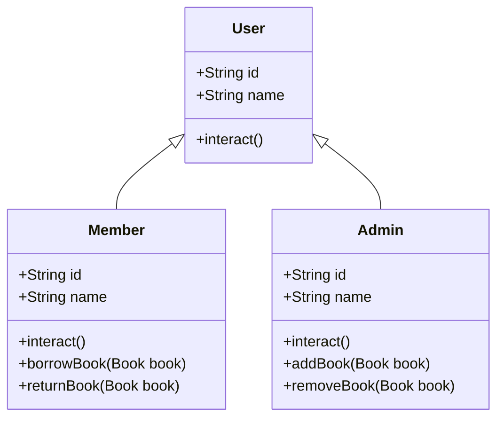

Class diagram:


output sample:
```text
### call interact()

Admin managing the library system.
Member borrowing or returning books.

### admin adding books

Book added successfully!
Book added successfully!
Book added successfully!
Book added successfully!
Book added successfully!

### admin removing books

Book removed successfully!

### admin trying to find book by title

Book found!

Process finished with exit code 0

```