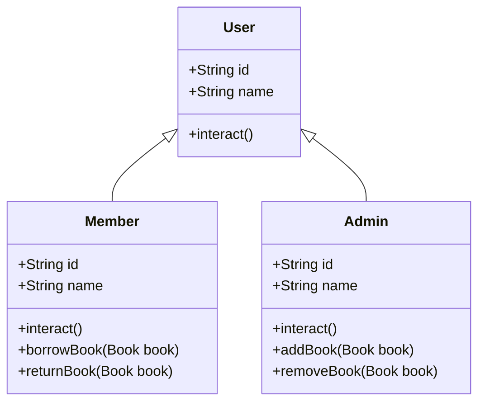

Class diagram:

# Inheritance (Pewarisan):
Class Admin dan Member mewarisi class User. Artinya, mereka memiliki atribut dan method dasar dari User.

# Polymorphism:
Method interact() di‐override pada Admin dan Member. Hasilnya, meskipun dipanggil melalui referensi User, perilaku interact() akan berbeda tergantung objeknya.