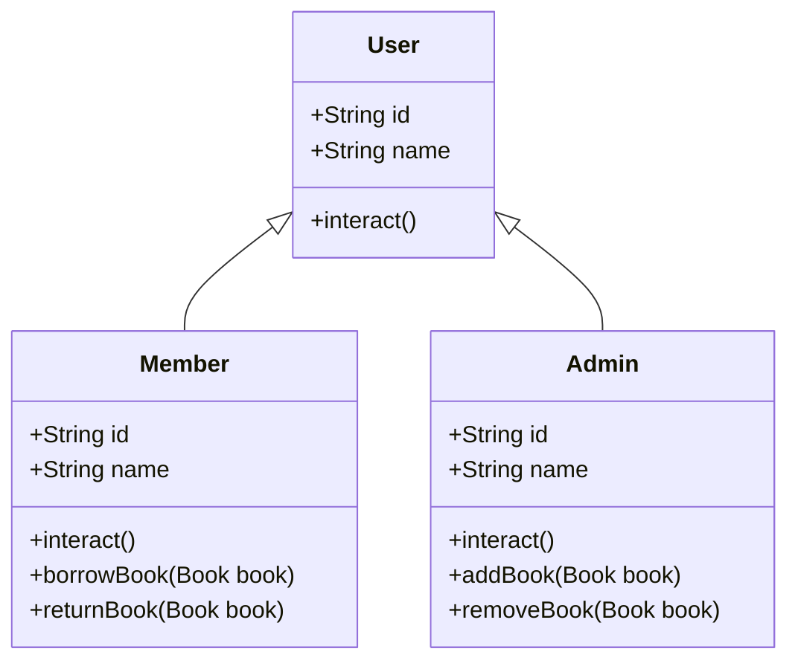

Class diagram:


output sample:
```
Admin managing the library system.
Member borrowing or returning books.
Book added successfully!
Book added successfully!
Book added successfully!
Book added successfully!
Book added successfully!
Book not found!
Book borrowed successfully!
Book borrowed successfully!
Book returned successfully!
Book returned successfully!

Process finished with exit code 0
```