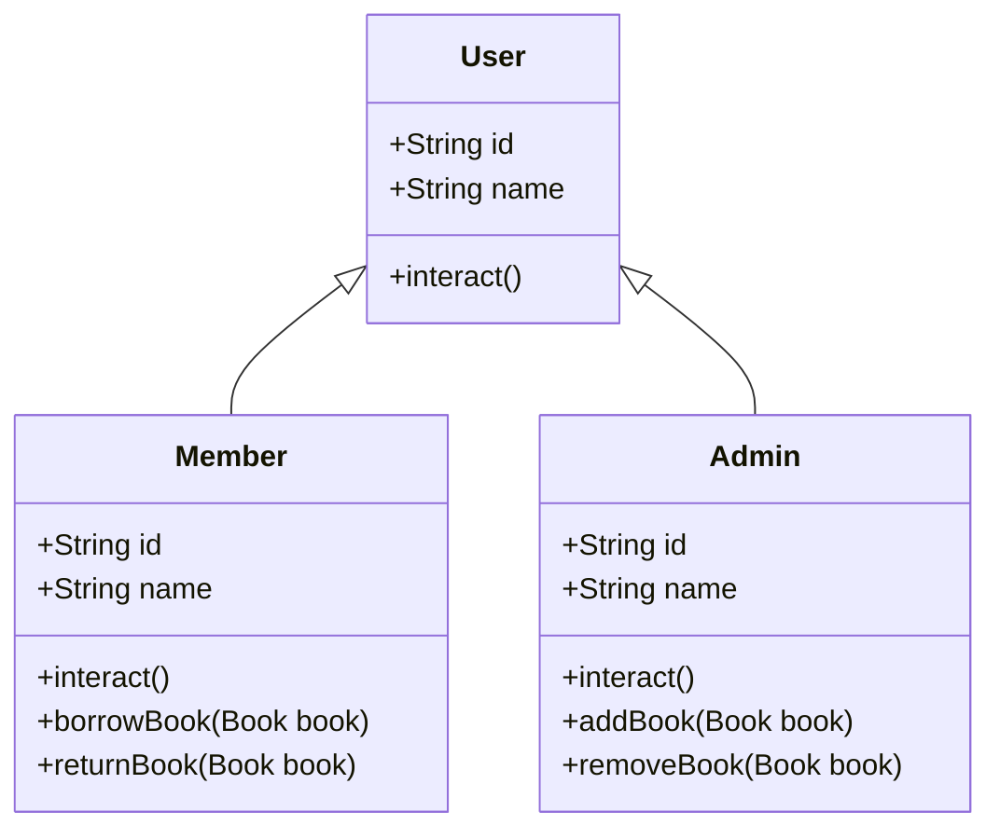

Class diagram:


output sample:
```text
### call interact()
Admin managing the library system.
Member borrowing or returning books.
### admin adding books
Book added successfully!
Book added successfully!
Book added successfully!
Book added successfully!
Book added successfully!
### admin removing books
Book removed successfully!
### member borrowing books
Book borrowed successfully!
Book borrowed successfully!
### member returning books
Book returned successfully!
### admin trying to find book by title
Book found!
### list books
Self-Esteem For Dummies by S. Renee Smith and Vivian Harte, available=true
java for dummies by Barry A. Burd, available=true
Python for dummies by John Paul Mueller, available=false
JavaScript for dummies by Doug Lowe, available=true
null
null
null
null
null
null

Process finished with exit code 0
```